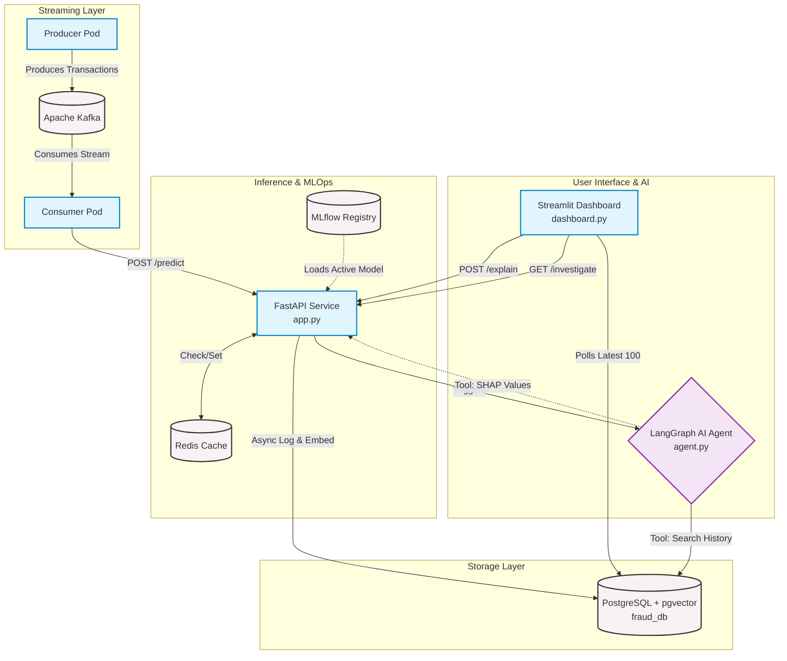

# 🛡️ Agentic AI Fraud Detection System (V4.0)


An enterprise-grade, event-driven microservices pipeline for detecting and investigating fraudulent credit card transactions. Moving beyond simple classification, this system leverages an autonomous **Agentic AI** workflow connected to a **Vector Database (pgvector)** RAG pipeline to generate explainable, human-readable audit reports in real-time.

## 🚀 Key Features

* **Kubernetes Orchestration:** Fully decoupled microservices architecture designed for fault tolerance and horizontal scaling.
* **Agentic AI Investigation:** An on-demand LangGraph agent that queries historical vector embeddings and SHAP values to explain *why* a transaction was flagged.
* **Real-Time Inference Pipeline:** Sub-100ms latency achieved by decoupling ingestion (Apache Kafka) from inference (FastAPI) with a Redis read-through caching layer.
* **Vector RAG Storage:** JIT (Just-In-Time) embedding generation stored in PostgreSQL (`pgvector`) to find mathematically similar historical fraud patterns.
* **Automated MLOps:** Containerized training jobs that automatically version and register XGBoost models via MLflow.
* **Live Investigation Dashboard:** An interactive Streamlit UI for monitoring traffic, visualizing SHAP feature importance, and deploying the AI agent.

## 🏗️ Architecture Flow

1. **Ingestion:** A Producer simulates transactions and pushes them to a **Kafka** topic.
2. **Streaming:** A Consumer pulls from Kafka and hits the **FastAPI** Inference endpoint.
3. **Prediction:** FastAPI checks **Redis** for cached predictions, loads the active model from **MLflow**, and calculates risk.
4. **Storage:** Background tasks generate LLM embeddings and save the raw data, predictions, and vectors to **PostgreSQL**.
5. **Investigation:** Analysts use the **Streamlit** dashboard to trigger the GenAI Agent, which uses tools to hit the `/explain` endpoint and search the Vector DB for historical context.

## 🛠️ Tech Stack

* **AI & Machine Learning:** Scikit-Learn, XGBoost, SHAP, LangChain, LangGraph, Gemini API.
* **Streaming & Compute:** Confluent Kafka, Zookeeper, FastAPI.
* **Database & Cache:** PostgreSQL (`pgvector`), Redis.
* **MLOps & DevOps:** MLflow, Docker, Kubernetes (Minikube/Kind).

---

## ⚡ Quick Start (Local Kubernetes Cluster)

### Prerequisites
* [Docker Desktop](https://www.docker.com/products/docker-desktop/) installed.
* [Minikube](https://minikube.sigs.k8s.io/docs/start/) or Kind installed.
* `kubectl` CLI installed.
* A Google Gemini API Key.

### 1. Start your Local Cluster
Spin up your local Kubernetes environment:
```bash
minikube start --cpus 4 --memory 8192
```

### 2. Configure Secrets
The AI Agent requires an API key to run investigations. Store it securely in the cluster:

```bash
kubectl create secret generic fraud-secrets \
  --from-literal=GEMINI_API_KEY="your_actual_api_key_here"
```

### 3. Deploy the Microservices
Apply the Kubernetes manifests (assuming they are in a `k8s/` folder):

```bash
kubectl apply -f k8s/configmap.yaml
kubectl apply -f k8s/postgres.yaml
kubectl apply -f k8s/redis.yaml
kubectl apply -f k8s/kafka.yaml
kubectl apply -f k8s/mlflow.yaml
```

Wait for the databases and MLflow to be running before deploying the compute layers.

```bash
kubectl apply -f k8s/init-model.yaml
# Wait for the model training job to complete, then deploy the rest:
kubectl apply -f k8s/inference.yaml
kubectl apply -f k8s/producer.yaml
kubectl apply -f k8s/consumer.yaml
kubectl apply -f k8s/dashboard.yaml
```
### 4. Access the Dashboards (Port Forwarding)
Because Kubernetes isolates networks, you need to forward the ports to your local machine.

Open a new terminal and forward the **Streamlit Dashboard**:
```bash
kubectl port-forward svc/dashboard-service 8501:8501
```

Open another terminal and forward the **MLflow Registry**:
```bash
kubectl port-forward svc/mlflow-service 5000:5000
```

- **Live Dashboard**: http://localhost:8501
- **MLflow UI**: http://localhost:5000
---

📂 Project Structure

```text
├── Dockerfile
├── Dockerfile.mlflow
├── LICENSE
├── README.md
├── check_health.py
├── docker-compose.yml
├── k8s
│   ├── configmap.yaml
│   ├── consumer.yaml
│   ├── dashboard.yaml
│   ├── inference.yaml
│   ├── init-model.yaml
│   ├── mlflow.yaml
│   ├── postgres.yaml
│   └── producer.yaml
├── mlflow_store
│   └── mlflow.db
├── poetry.lock
├── pyproject.toml
├── src
│   ├── __init__.py
│   ├── agent
│   │   ├── __init__.py
│   │   ├── agent.py
│   │   └── tools.py
│   ├── api
│   │   ├── __init__.py
│   │   └── app.py
│   ├── core
│   │   ├── database.py
│   │   └── utils.py
│   ├── data_pipeline
│   │   ├── __init__.py
│   │   ├── consumer.py
│   │   └── producer.py
│   ├── ml
│   │   ├── __init__.py
│   │   └── train_in_docker.py
│   └── ui
│       └── dashboard.py
└── tests
    ├── test_agent.py
    ├── test_agent_loop.py
    ├── test_api.py
    ├── test_llm.py
    └── test_tools.py
```



